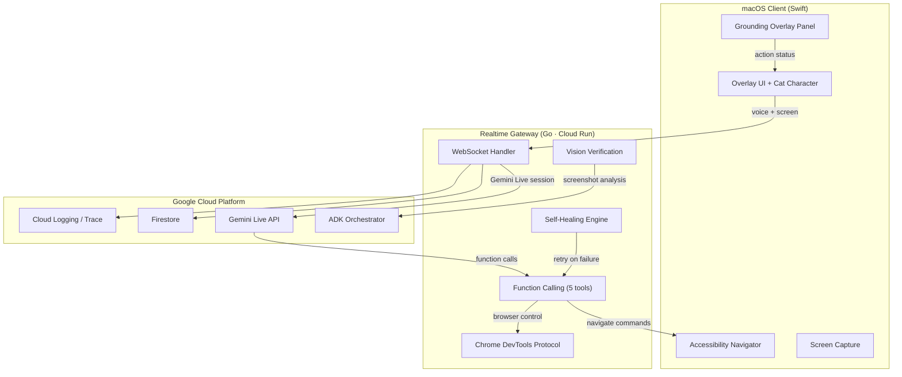

<p align="center">
  
</p>

<h1 align="center">VibeCat</h1>

<p align="center">
  <strong>Your Proactive Desktop Companion — an AI that sees your screen, suggests before you ask, and acts with your permission.</strong>
</p>

<p align="center">
  <a href="https://geminiliveagentchallenge.devpost.com/"></a>
  
  
  
  
  
</p>

---

## What Is VibeCat?

VibeCat is a **native macOS desktop companion** that watches your screen, understands your context, and **proactively suggests actions before you ask**. Unlike traditional automation tools that wait for commands, VibeCat observes your workflow and offers help — like a senior colleague sitting next to you.

### Core Flow: OBSERVE → SUGGEST → WAIT → ACT → FEEDBACK

1. **OBSERVE** — VibeCat continuously watches your screen via Gemini Live API (screenshots + accessibility tree)
2. **SUGGEST** — When it spots an opportunity, it speaks up: *"I notice a bug in that function — want me to fix it?"*
3. **WAIT** — It always waits for your confirmation before acting
4. **ACT** — Upon approval, it executes precise actions across your desktop apps
5. **FEEDBACK** — After acting, it verifies the result and reports back: *"Done! The fix is applied. Looks good?"*

### What Makes VibeCat Different

| Feature | Traditional UI Agents | VibeCat |
|---------|----------------------|---------|
| **Interaction model** | Reactive — waits for commands | **Proactive** — suggests before you ask |
| **Interface** | Text-based CLI or scripted | **Voice-first** — natural conversation via Gemini Live API |
| **Platform** | Python + cross-platform wrappers | **Native macOS Swift** — first-class citizen |
| **Architecture** | Local-only execution | **Cloud-assisted reasoning** — Cloud Run + ADK |
| **Error handling** | Fails and reports | **Self-healing** — retries with alternative strategies |
| **Verification** | Basic state check | **Triple-source grounding** — Accessibility + CDP + Vision |
| **Transparency** | Silent processing | **Real-time feedback** — narrates every step |

## Demo Scenarios

VibeCat is optimized for three gold-tier surfaces:

### 1. Music Suggestion (Chrome/YouTube)
> *"You've been coding for a while — want me to put on some music?"*
> → User: *"Sure!"*
> → VibeCat opens YouTube, searches for focus music, starts playback
> → *"There you go! Let me know if you want something different."*

### 2. Code Fix Suggestion (Antigravity IDE)
> *"I see a potential null check missing in that function — should I add it?"*
> → User: *"Yeah, go ahead"*
> → VibeCat triggers inline edit, inserts the fix
> → *"Done! The null check is in place. Want me to run the tests?"*

### 3. Terminal Command Improvement (Terminal/iTerm2)
> *"That ls could show more detail with -la — want me to rerun it?"*
> → User: *"Do it"*
> → VibeCat types and executes the improved command
> → *"Here's the detailed listing. Notice the hidden files now showing?"*

## Architecture



### Component Overview

| Layer | Technology | Role |
|-------|-----------|------|
| **macOS Client** | Swift 6 / AppKit | Screen capture, AX execution, overlay UI, voice transport |
| **Realtime Gateway** | Go 1.24 / Cloud Run | WebSocket handler, FC tool routing, self-healing, vision verification |
| **Gemini Live API** | Google GenAI SDK | Real-time voice conversation, screen understanding, function calling |
| **ADK Orchestrator** | Go / Cloud Run | Confidence escalation, screenshot analysis, memory/replay |
| **Chrome Controller** | chromedp (CDP) | Direct browser element interaction beyond accessibility tree |

### Navigator Tools (Function Calling)

VibeCat registers 5 tools with Gemini for precise desktop control:

| Tool | Purpose | Example |
|------|---------|---------|
| `navigate_text_entry` | Type text into focused field | Search queries, code snippets |
| `navigate_hotkey` | Send keyboard shortcuts | `Cmd+S`, `Space` (YouTube play/pause) |
| `navigate_focus_app` | Switch to a specific application | Open Chrome, switch to Terminal |
| `navigate_open_url` | Open a URL in the default browser | YouTube links, documentation |
| `navigate_type_and_submit` | Type text and press Enter | Terminal commands, search submissions |

### Self-Healing Navigation

When an action fails, VibeCat doesn't just report the error — it retries with alternative strategies:

1. **First attempt** — Execute via primary method (AX or hotkey)
2. **Retry 1** — Try alternative grounding source (CDP for browsers, different AX path)
3. **Retry 2** — Fall back to vision-based coordinate targeting
4. **Each retry** — Vision verification confirms the action succeeded before proceeding

### Grounding Sources

VibeCat uses triple-source grounding to prevent blind clicking:

- **Accessibility (AX)** — Native macOS accessibility tree for UI elements
- **CDP** — Chrome DevTools Protocol for precise browser interaction
- **Vision** — Gemini screenshot analysis for visual verification
- **Keyboard** — Direct hotkey injection for app-specific shortcuts

## Quick Start

### Prerequisites

- macOS 15+ (Sequoia)
- Xcode 16+ (for local client builds)
- Go 1.24+
- A Google Cloud project with:
  - Gemini API key
  - Cloud Run enabled
  - Firestore database
  - Secret Manager configured

### Build & Test

```bash
# Swift client
cd VibeCat
swift build
swift test          # 91 tests

# Go gateway
cd backend/realtime-gateway
go build ./...
go test ./...       # all packages pass
go vet ./...

# Go orchestrator
cd backend/adk-orchestrator
go build ./...
go test ./...
```

### Deploy to Cloud Run

```bash
# Deploy gateway
./infra/deploy.sh gateway

# Deploy orchestrator
./infra/deploy.sh orchestrator
```

### Runtime Permissions

VibeCat requires three macOS permissions:

| Permission | Required For |
|-----------|-------------|
| **Screen Recording** | Capturing screen content for Gemini vision analysis |
| **Accessibility** | Reading UI elements and executing navigation actions |
| **Microphone** | Voice input for Gemini Live API conversation |

## Project Structure

```text
vibeCat/
├── VibeCat/                          # Swift package: Core + macOS app + tests
│   ├── Sources/Core/                 # UI-free models, localization, parsers
│   ├── Sources/VibeCat/              # AppKit app, AX navigator, overlay UI
│   └── Tests/VibeCatTests/           # 91 package tests
├── backend/realtime-gateway/         # Go: WebSocket gateway, FC tools, self-healing
│   └── internal/
│       ├── ws/                       # Handler, navigator, metrics
│       ├── live/                     # Gemini Live session management
│       └── cdp/                      # Chrome DevTools Protocol controller
├── backend/adk-orchestrator/         # Go: ADK graph, escalation, memory/replay
├── tests/e2e/                        # Deployed smoke and live-path tests
├── infra/                            # GCP bootstrap, deploy scripts, observability
├── docs/                             # Architecture, status, evidence, research
└── Assets/                           # Sprites, tray icons, audio samples
```

## Deployment

| Service | Region | URL |
|---------|--------|-----|
| Realtime Gateway | asia-northeast3 | `realtime-gateway-*.run.app` |
| ADK Orchestrator | asia-northeast3 | `adk-orchestrator-*.run.app` |
| Firestore | `(default)` | Native database |

Infrastructure: Cloud Run, Firestore, Secret Manager, Cloud Logging, Cloud Trace, Cloud Monitoring

## Safety Model

VibeCat uses **safe-immediate execution** with mandatory confirmation for risky actions:

**Immediate (low-risk):** focus changes, page navigation, search entry, tab switching, hotkeys

**Confirmation required:** passwords/tokens, deploy/publish/send, destructive shell commands, `git push`, bulk code insertion

## Technology Stack

- **Gemini Live API** — Real-time multimodal conversation (voice + vision)
- **Gemini Function Calling** — Structured tool invocation for desktop actions
- **ADK (Agent Development Kit)** — Confidence escalation and screenshot analysis
- **Google Cloud Run** — Serverless backend hosting
- **chromedp** — Go-native Chrome DevTools Protocol client
- **macOS Accessibility API** — Native UI element discovery and manipulation

## Submission Assets

| Asset | Location |
|-------|----------|
| Architecture diagram | This README (Mermaid) |
| Current status | `docs/CURRENT_STATUS_20260312.md` |
| Deployment evidence | `docs/evidence/DEPLOYMENT_EVIDENCE.md` |
| GCP proof | `docs/deployment/PROOF_OF_GCP_DEPLOYMENT.md` |
| Research report | `docs/AGENT_ARCHITECTURE_RESEARCH_20260312.md` |

## License

This project is submitted to the [Gemini Live Agent Challenge](https://geminiliveagentchallenge.devpost.com/) (2026).
