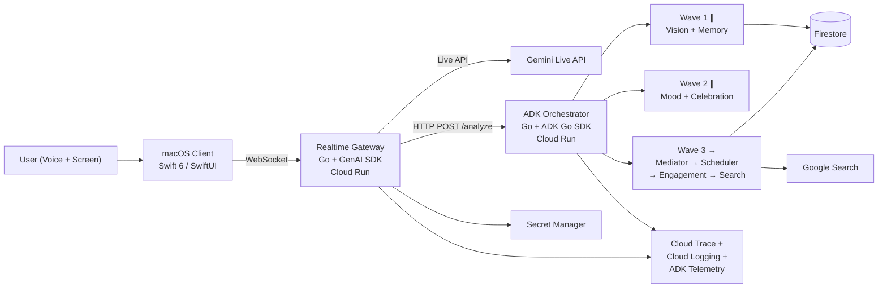

<p align="center">
  
</p>

<h1 align="center">VibeCat</h1>

<p align="center">
  <strong>Your AI coding companion that watches, listens, remembers, and helps.</strong>
</p>

<p align="center">
  <a href="https://geminiliveagentchallenge.devpost.com/"></a>
  
  
  
  
  <a href="https://github.com/Two-Weeks-Team/vibeCat/issues"></a>
  
</p>

<p align="center">
  <a href="#architecture">Architecture</a> &#8226;
  <a href="#9-agents">9 Agents</a> &#8226;
  <a href="#characters">Characters</a> &#8226;
  <a href="#quick-start">Quick Start</a> &#8226;
  <a href="#deployment">Deployment</a> &#8226;
  <a href="#documentation">Documentation</a>
</p>

---

## What is VibeCat?

VibeCat is a **macOS desktop companion for solo developers** — filling the empty chair next to you.

When you code alone, there is no one to catch your typos, notice you are stuck, or celebrate when your tests finally pass. VibeCat sits on your screen as an animated character that **sees your work, hears your voice, remembers yesterday's context, senses your frustration, and speaks up only when it matters**.

It is not a chatbot that waits for your question. It is a colleague that watches, listens, cares, and helps.

> Built for the [Gemini Live Agent Challenge 2026](https://geminiliveagentchallenge.devpost.com/) using **GenAI SDK** + **Google ADK** + **Gemini Live API** + **VAD**.

---

## Architecture



### Three-Layer Split

| Layer | Technology | Location | Role |
|-------|-----------|----------|------|
| **macOS Client** | Swift 6 / SwiftUI | `VibeCat/` | UI, screen capture, audio playback, gestures |
| **Realtime Gateway** | Go + `google.golang.org/genai` | `backend/realtime-gateway/` | WebSocket proxy to Gemini Live API |
| **ADK Orchestrator** | Go + `google.golang.org/adk` | `backend/adk-orchestrator/` | 9-agent graph, decision-making |
| **Persistence** | Firestore | GCP `asia-northeast3` | Sessions, metrics, memory |

### Key Protocols

- **Client ↔ Gateway**: WebSocket (`wss://{host}/ws/live`) + REST (`/api/v1/`)
- **Gateway ↔ Orchestrator**: HTTP `POST /analyze`
- **Audio**: PCM 16kHz 16-bit mono (client → server), PCM 24kHz (server → client)
- **Auth**: Ephemeral tokens, API key in GCP Secret Manager (never on client)

---

## 9 Agents

A chatbot answers. A colleague **sees, hears, judges, adapts, remembers, cares, celebrates, and helps**.

| Agent | Colleague Role | What It Does |
|-------|---------------|-------------|
| **VAD** | Natural conversation | Barge-in interruption, real-time turn-taking |
| **VisionAgent** | Second pair of eyes | Analyzes screen captures for errors and context |
| **Mediator** | Social awareness | Decides when to speak and when to stay quiet |
| **AdaptiveScheduler** | Rhythm awareness | Adjusts timing based on interaction patterns |
| **EngagementAgent** | Initiative | Reaches out when you've been quiet too long |
| **MemoryAgent** | Long-term memory | Remembers past sessions, unresolved issues |
| **MoodDetector** | Emotional awareness | Senses frustration, suggests breaks, offers help |
| **CelebrationTrigger** | Cheerleader | Detects success moments and celebrates with you |
| **SearchBuddy** | Research assistant | Searches for solutions when you're stuck |

---

## Characters

6 animated characters with unique voices and personalities. Each has a [`soul.md`](Assets/Sprites/cat/soul.md) defining their persona:

| Character | Role | Voice | Tone |
|-----------|------|-------|------|
|  **cat** | Curious beginner companion | Zephyr | bright, casual |
|  **derpy** | Goofy accidental debugger | Puck | goofy, clumsy |
|  **jinwoo** | Silent senior engineer | Kore | low-calm, concise |
|  **kimjongun** | Supreme debugger (comedy) | Schedar | authoritative-warm |
|  **saja** | Zen mentor from folklore | Zubenelgenubi | calm-deep, archaic |
|  **trump** | Bombastic hype-man (comedy) | Fenrir | energetic-superlative |

---

## Quick Start

### Prerequisites

- macOS 15.0+, Xcode 16+
- Go 1.24+
- GCP project with Firestore, Secret Manager, Cloud Run enabled
- Gemini API key stored in Secret Manager as `vibecat-gemini-api-key`

### Build & Run (Client)

```bash
make build   # Build Swift package
make sign    # Codesign for dev
make run     # Build + sign + run
make test    # Run Swift tests
```

### Build & Run (Backend)

```bash
# Local development
cd backend/realtime-gateway && go run .
cd backend/adk-orchestrator && go run .

# Run tests
cd backend/realtime-gateway && go test ./...
cd backend/adk-orchestrator && go test ./...
```

---

## Deployment

### One-Time GCP Setup

```bash
./infra/setup.sh    # Enable APIs, create Firestore, Secret Manager, Artifact Registry, IAM
```

### Deploy to Cloud Run

```bash
./infra/deploy.sh     # Build + deploy both services to asia-northeast3
./infra/teardown.sh   # Remove deployment
```

### GCP Resources

| Resource | Service |
|----------|---------|
| **Cloud Run** | `realtime-gateway`, `adk-orchestrator` |
| **Firestore** | Session data, metrics, cross-session memory |
| **Secret Manager** | `vibecat-gemini-api-key`, `vibecat-gateway-auth-secret` |
| **Artifact Registry** | `vibecat-images` container repo |
| **Cloud Build** | Automated build pipeline |
| **Observability** | Cloud Logging, Monitoring, Trace |

---

## Documentation

| Document | Description |
|----------|-------------|
| [Master PRD](docs/PRD/LIVE_AGENTS_PRD.md) | Business model, agent philosophy, architecture |
| [Document Index](docs/PRD/INDEX.md) | Complete document map |
| [Implementation Tasks (Client)](docs/PRD/DETAILS/END_TO_END_IMPLEMENTATION_TASKS.md) | T-001 ~ T-099 (64 tasks) |
| [Implementation Tasks (Backend)](docs/PRD/DETAILS/BACKEND_IMPLEMENTATION_TASKS.md) | T-100 ~ T-175 (58 tasks) |
| [Backend Architecture](docs/PRD/DETAILS/BACKEND_ARCHITECTURE.md) | 9-agent graph, Firestore schema, service contracts |
| [Client-Backend Protocol](docs/PRD/DETAILS/CLIENT_BACKEND_PROTOCOL.md) | WebSocket/REST spec, message types, error codes |
| [Deployment & Operations](docs/PRD/DETAILS/DEPLOYMENT_AND_OPERATIONS.md) | GCP Cloud Run, observability, security |
| [Implementation Execution Plan](docs/PRD/DETAILS/IMPLEMENTATION_EXECUTION_PLAN.md) | Build sequence, module dependencies |
| [TDD Verification Plan](docs/PRD/DETAILS/TDD_VERIFICATION_PLAN.md) | Red-Green-Refactor implementation order |
| [Asset Migration Plan](docs/PRD/DETAILS/ASSET_MIGRATION_PLAN.md) | Asset inventory, counts, verification |
| [Submission & Demo Plan](docs/PRD/DETAILS/SUBMISSION_AND_DEMO_PLAN.md) | Demo flow, submission artifacts |
| [CloudBuild Spec](docs/PRD/DETAILS/CLOUDBUILD_SPEC.md) | Cloud Build YAML specs |

---

## Project Structure

```
vibeCat/
├── VibeCat/
│   ├── Package.swift              # SPM manifest (swift-tools-version 6.2)
│   ├── Sources/Core/              # Pure Swift modules (no UI deps)
│   ├── Sources/VibeCat/           # macOS app (UI, capture, transport)
│   └── Tests/VibeCatTests/
├── backend/
│   ├── realtime-gateway/          # Go + GenAI SDK (Live API WebSocket proxy)
│   └── adk-orchestrator/          # Go + ADK Go SDK (9-agent graph)
├── infra/
│   ├── setup.sh                   # One-time GCP project bootstrap
│   ├── deploy.sh                  # Build + deploy to Cloud Run
│   └── teardown.sh                # Remove Cloud Run services
├── Assets/
│   ├── Sprites/{character}/       # 6 characters, ~16 frames each
│   │   ├── preset.json            # Voice, size, persona config
│   │   └── soul.md                # Character personality prompt
│   ├── TrayIcons/                 # Menu bar animation frames
│   └── Music/                     # Background lo-fi tracks
├── docs/
│   ├── PRD/                       # Product requirements (15+ docs)
│   └── reference/                 # External SDK/GCP reference (~40 files)
└── voice_samples/                 # Voice sample files
```

---

## Tech Stack

| Category | Technology |
|----------|-----------|
| **Client** | Swift 6, SwiftUI, SPM, CoreGraphics, AVFoundation |
| **Backend** | Go 1.24+, `google.golang.org/genai`, `google.golang.org/adk` |
| **AI Models** | `gemini-2.5-flash-native-audio-latest` (Live), `gemini-2.5-flash-preview-tts` (TTS), `gemini-3.1-flash-lite-preview` (Vision) |
| **GenAI SDK** | Live API (VAD, Barge-in, AffectiveDialog, SessionResumption, ContextWindowCompression, OutputTranscription) |
| **ADK** | Runner, ParallelAgent, SequentialAgent, LLMAgent, Session State, InMemoryService (memory + session), Telemetry, FunctionTool, GeminiTool (GoogleSearch) |
| **Agent Graph** | 9 agents in 3 waves: Perception (Vision∥Memory) → Emotion (Mood∥Celebration) → Decision (Mediator→Scheduler→Engagement→Search) |
| **Infrastructure** | GCP Cloud Run (2 services), Firestore, Secret Manager, Artifact Registry |
| **Observability** | Cloud Trace (OpenTelemetry spans), Cloud Logging (structured), ADK Telemetry |
| **Auth** | Device UUID (zero-onboarding, no client-side API keys) |
| **CI/CD** | Cloud Build, `infra/deploy.sh` |

---

## Contributing

See the [GitHub Issues](https://github.com/Two-Weeks-Team/vibeCat/issues) for all 122 implementation tasks with detailed specs and document references.

Each issue includes:
- Goal and implementation steps
- Clickable links to reference documents
- Verification / acceptance criteria
- Task dependencies

Filter by label to find work in your area:
- [`client`](https://github.com/Two-Weeks-Team/vibeCat/labels/client) — macOS Swift app (64 tasks)
- [`backend`](https://github.com/Two-Weeks-Team/vibeCat/labels/backend) — Go backend services (58 tasks)
- [`backend:gateway`](https://github.com/Two-Weeks-Team/vibeCat/labels/backend%3Agateway) — Realtime Gateway
- [`backend:orchestrator`](https://github.com/Two-Weeks-Team/vibeCat/labels/backend%3Aorchestrator) — ADK Orchestrator

---

## Challenge

<table>
  <tr>
    <td><strong>Event</strong></td>
    <td><a href="https://geminiliveagentchallenge.devpost.com/">Gemini Live Agent Challenge 2026</a></td>
  </tr>
  <tr>
    <td><strong>Track</strong></td>
    <td>Live Agents</td>
  </tr>
  <tr>
    <td><strong>Required Stack</strong></td>
    <td>GenAI SDK + ADK + Gemini Live API + VAD</td>
  </tr>
  <tr>
    <td><strong>Submission</strong></td>
    <td>Demo video (4 min) + Blog post (<code>#GeminiLiveAgentChallenge</code>)</td>
  </tr>
</table>

---

## License

MIT License. See [LICENSE](LICENSE) for details.
