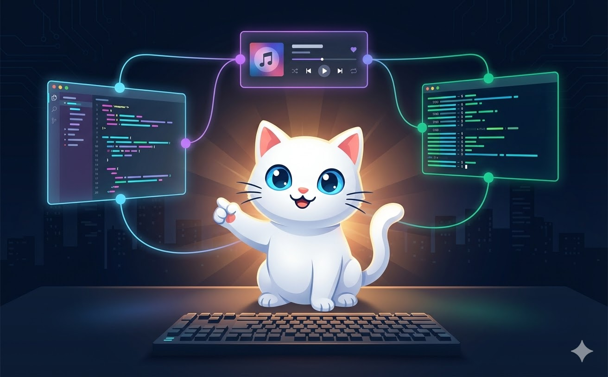
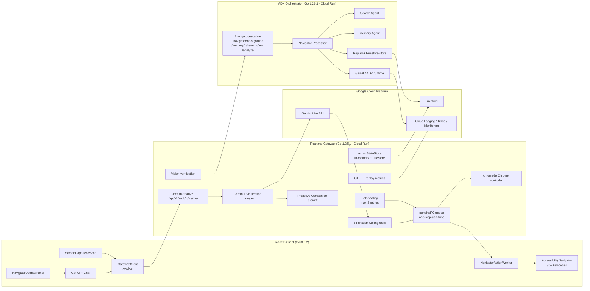
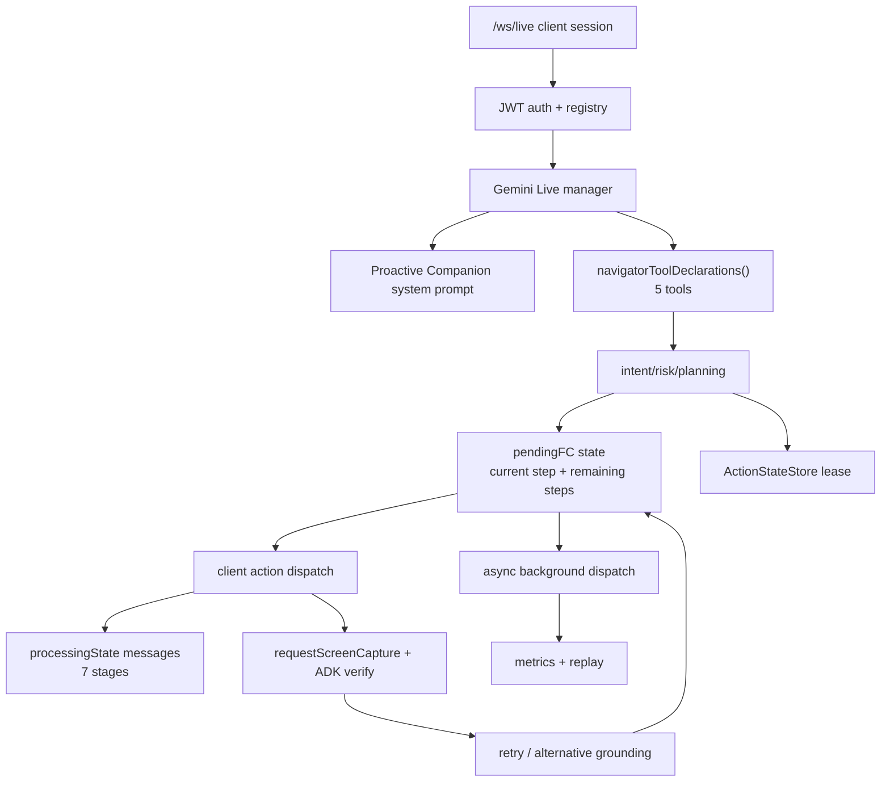
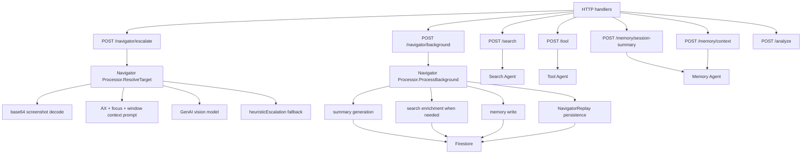

<p align="center">
  
</p>

<h1 align="center">VibeCat</h1>

<p align="center">
  <strong>Your Proactive Desktop Companion — an AI that sees your screen, suggests before you ask, and acts with your permission.</strong>
</p>

<p align="center">
  <a href="https://geminiliveagentchallenge.devpost.com/"></a>
  
  
  
  
  
</p>

---

## The Problem

<p align="center">
  
</p>

Every AI coding tool today is **reactive** — it sits quietly until you type a command, paste an error, or open a chat window. You break your flow to talk to the AI, and the AI breaks your flow to talk back.

> *"Every AI tool waits for your command. But what if one didn't?"*

The context switch is the real cost. You're deep in a flow state, and suddenly you need to look something up, fix a typo in a terminal command, or find that one Stack Overflow answer. Traditional AI assistants can't help until you stop what you're doing and ask — by which point you've already lost minutes of mental re-entry time.

## The Flip

<p align="center">
  
</p>

> *"Meet VibeCat — a desktop companion that suggests before you ask."*

VibeCat is a **native macOS desktop companion** that watches your screen, understands your context, and **proactively suggests actions before you ask**. Instead of waiting for commands, it watches your screen, recognizes opportunities, and speaks up first: *"I notice a null check missing — want me to add it?"* — then waits for your approval before touching anything. Like a senior colleague sitting next to you.

### Core Flow: OBSERVE → SUGGEST → WAIT → ACT → FEEDBACK

1. **OBSERVE** — VibeCat continuously watches your screen via Gemini Live API (screenshots + accessibility tree)
2. **SUGGEST** — When it spots an opportunity, it speaks up: *"I notice a bug in that function — want me to fix it?"*
3. **WAIT** — It always waits for your confirmation before acting
4. **ACT** — Upon approval, it executes precise actions across your desktop apps
5. **FEEDBACK** — After acting, it verifies the result and reports back: *"Done! The fix is applied. Looks good?"*

### What Makes VibeCat Different

| Feature | Traditional UI Agents | VibeCat |
|---------|----------------------|---------|
| **Interaction model** | Reactive — waits for commands | **Proactive** — suggests before you ask |
| **Interface** | Text-based CLI or scripted | **Voice-first** — natural conversation via Gemini Live API |
| **Platform** | Python + cross-platform wrappers | **Native macOS Swift** — first-class citizen |
| **Architecture** | Local-only execution | **Cloud-assisted reasoning** — Cloud Run + ADK |
| **Error handling** | Fails and reports | **Self-healing** — retries with alternative strategies |
| **Verification** | Basic state check | **Triple-source grounding** — Accessibility + CDP + Vision |
| **Transparency** | Silent processing | **Real-time feedback** — narrates every step |

## Demo Scenarios

VibeCat is optimized for three gold-tier surfaces:

### Act 1. Proactive Music Suggestion (YouTube Music)
> VibeCat greets you on session start: *"Hey! How about some relaxing background music while you work?"*
> → User: *"Yes, play it."*
> → VibeCat opens YouTube Music, searches for relaxing coding music, uses **vision-based mouse control** to find and click the play button
> → *"Music is playing! Enjoy your coding session."*

### Act 2. Proactive Code Enhancement (Antigravity IDE)
> VibeCat reads your code and spots an opportunity: *"I can enhance the comments for this code — want me to?"*
> → User: *"Sure, go ahead"*
> → VibeCat clicks Gemini Chat in the IDE, types the enhancement request, and Gemini improves documentation
> → *"Done! The comments are enhanced with detailed documentation."*

### Act 3. Terminal Automation (Terminal)
> VibeCat switches to Terminal and suggests a lint check: *"Want me to run go vet to check for lint issues?"*
> → User: *"Do it"*
> → VibeCat types `go vet ./...` and executes it
> → *"Lint check passed! No issues found."*

## Architecture

### Version Matrix

| Component | In Repo | Latest Stable | Official Source | Notes |
|-----------|---------|---------------|-----------------|-------|
| **Go** | 1.26.1 | 1.26.1 | `https://go.dev/dl/` | backend modules + e2e aligned |
| **Swift tools-version** | 6.2 | 6.2.4 | `https://swift.org/install/` | package format stays `6.2`; locally verified on Swift 6.2.4 |
| **Google GenAI SDK** | v1.49.0 | v1.49.0 | `https://pkg.go.dev/google.golang.org/genai` | Gemini Live / vision / FC client |
| **Google ADK for Go** | v0.6.0 | v0.6.0 | `https://pkg.go.dev/google.golang.org/adk` | orchestrator framework |
| **chromedp** | v0.14.2 | v0.14.2 | `https://pkg.go.dev/github.com/chromedp/chromedp` | browser control via CDP |
| **Docker Go builder** | `golang:1.26.1-alpine` | Go 1.26.1 line | `https://go.dev/dl/` | both backend images |
| **Distroless runtime** | `gcr.io/distroless/static-debian12` | rolling Debian 12 | `https://github.com/GoogleContainerTools/distroless` | runtime-only image |

### System Overview



### What Each Service Owns

| Service | Owns | Does Not Own |
|---------|------|--------------|
| **macOS Client** | UI, microphone, screen capture, AX execution, local keyboard events, overlay feedback | Gemini credentials, tool planning, server-side memory |
| **Realtime Gateway** | live multimodal session, prompt, FC tool handling, task queueing, retries, verification orchestration, state leases | long-term memory strategy, desktop rendering, raw local OS control |
| **ADK Orchestrator** | screenshot reasoning, target escalation, visible-text extraction, async summary/research/memory/replay | direct desktop execution, step-by-step UI clicking |

### Component Overview

| Layer | Technology | Role |
|-------|-----------|------|
| **macOS Client** | Swift 6.2 / AppKit | Screen capture, AX executor (80+ key codes), overlay with grounding badges, voice transport, local action worker |
| **Realtime Gateway** | Go 1.26.1 / Cloud Run | WebSocket handler, Proactive Companion prompt, 5 FC tool handlers, pendingFC sequential execution, self-healing, vision verification, transparent feedback pipeline |
| **Gemini Live API** | Google GenAI SDK v1.49.0 | Real-time multimodal conversation (voice + vision), function calling, session resumption, VAD |
| **ADK Orchestrator** | Go 1.26.1 / ADK v0.6.0 / Cloud Run | Confidence escalation, screenshot interpretation, visible-text extraction, async summary/memory/replay/research enrichment |
| **Chrome Controller** | chromedp v0.14.2 | Click, Type, Navigate, Scroll, Screenshot, Close — lazy connect with graceful fallback |

### Client UI Panel Layout

All UI panels follow the cat sprite in real-time. The cat roams freely across all monitors inside a full-screen borderless `CatPanel`.

```
                 ┌─────────────────┐
                 │ CompanionChat   │  ← cat +70pt (on show)
                 │ (360×360, key)  │     interactive, movable
                 └─────────────────┘
                 ┌───────────┐
                 │  Speech   │  ← above cat (flips below if off-screen)
                 └─────┬─────┘
                       🐱          ← CatPanel sprite (follows mouse)
                 ┌─────┴─────┐                    ┌──────────────┐
                 │  Status   │  ← below cat        │ DecisionHUD  │ ← cat +50pt right
                 └───────────┘                    │ (280×160)    │    debug info
              ┌────────────────────┐              └──────────────┘
              │ NavigatorOverlay   │  ← cat -90pt (below status area)
              │ (260×52, grounding)│     follows cat in real-time
              └────────────────────┘

        ╔═══════════════╗
        ║TargetHighlight║  ← overlays AX target element (independent of cat)
        ╚═══════════════╝
```

| Panel | Anchor | Follows Cat | Interactive |
|-------|--------|-------------|-------------|
| **CatPanel** | Full screen, sprite moves inside | Is the cat | No (click-through) |
| **Speech Bubble** | Above cat, flips below if clipped | Real-time | No |
| **Status Bubble** | Below cat, below window badge | Real-time | No |
| **NavigatorOverlay** | 90pt below cat center | Real-time | No |
| **DecisionOverlayHUD** | 50pt right of cat center | Real-time | No |
| **CompanionChatPanel** | 70pt above cat on show() | On show only | Yes (typing, movable) |
| **TargetHighlightOverlay** | On AX target element + 6pt padding | Follows target | No |

### Realtime Gateway Architecture



### ADK Orchestrator Architecture

The README previously compressed ADK into one box. This is the actual shape of the service.



### Orchestrator Endpoint Contracts

| Endpoint | Sync/Async | Input | Output | Purpose |
|----------|------------|-------|--------|---------|
| `POST /navigator/escalate` | sync | command + screenshot + AX/focus context | target descriptor / resolved text / confidence | low-confidence target resolution and visible text extraction |
| `POST /navigator/background` | async-style post-task | task outcome + attempts + context hashes | summary / replay label / research summary / tags | off-hot-path summarization and replay labeling |
| `POST /memory/session-summary` | sync | history | stored summary | session memory write |
| `POST /memory/context` | sync | user id | memory context | memory recall |
| `POST /search` | sync | query | summary + sources | research enrichment |
| `POST /tool` | sync | tool query | tool-specific result | non-live tool path |
| `POST /analyze` | sync | image + context | multimodal analysis | retained general analysis path |

### Gateway Endpoint Contracts

| Endpoint | Auth | Purpose |
|----------|------|---------|
| `/health` | no | liveness + connection count |
| `/readyz` | no | readiness |
| `/api/v1/auth/register` | no | issue JWT |
| `/api/v1/auth/refresh` | no | refresh JWT |
| `/ws/live` | yes | main client transport for Live PM + navigator runtime |

### State and Persistence

| State | Where | Why |
|-------|------|-----|
| `ActionStateStore` | gateway memory + Firestore | reconnect-safe ownership, stale socket rejection, active task continuity |
| `pendingFC*` | in-memory live session state | sequential multi-step execution |
| `pendingVisionVerification` | in-memory live session state | hold screenshot verification intent between step and ADK response |
| `NavigatorReplay` | orchestrator Firestore store | post-task regression and evidence trail |
| ADK session/memory services | orchestrator in-memory + Firestore-backed app store | summaries and memory context |

### Observable Contracts

These are the runtime signals that make VibeCat debuggable instead of opaque:

- `processingState` messages for every navigator phase
- `requestScreenCapture` when post-action verification needs fresh evidence
- `time_to_first_action_ms` metric for hot-path responsiveness
- replay labels and research tags from `/navigator/background`
- action-state lease persistence for reconnect behavior

### Proactive Companion System Prompt

The gateway injects a **Proactive Companion** system prompt into every Gemini Live session. This prompt defines VibeCat's core identity — an attentive colleague, not a passive tool:

- **Proactive observation**: notices errors, long work sessions, inefficient commands, missing code
- **Natural suggestion**: *"You've been coding for a while — want me to play some music?"*
- **Confirmation gate**: always waits for user approval before acting
- **Friendly feedback**: *"Done! How does that look?"* after every action
- **Emotion tags**: `[happy]`, `[thinking]`, `[concerned]`, etc. for character expression
- **Language matching**: responds in the user's language (Korean, English, Japanese)

### Navigator Tools (Function Calling)

VibeCat registers 5 tools with Gemini via `navigatorToolDeclarations()` for precise desktop control:

| Tool | Parameters | Purpose | Example |
|------|-----------|---------|---------|
| `navigate_text_entry` | `text`, `target`, `submit` | Type text into focused field | Search queries, code snippets, form input |
| `navigate_hotkey` | `keys[]`, `target` | Send keyboard shortcuts | `Cmd+S`, `Space` (YouTube play/pause), `Cmd+I` (IDE inline) |
| `navigate_focus_app` | `app` | Switch to a specific application | Open Chrome, switch to Terminal, focus Antigravity |
| `navigate_open_url` | `url` | Open a URL in the default browser | YouTube links, documentation pages |
| `navigate_type_and_submit` | `text`, `submit` | Type text and press Enter | Terminal commands (`ls -la`), search submissions |

Each tool has a dedicated handler in the gateway: `handleNavigateHotkeyToolCall`, `handleNavigateFocusAppToolCall`, `handleNavigateOpenURLToolCall`, `handleNavigateTypeAndSubmitToolCall`.

### pendingFC: Sequential Multi-Step Execution

Complex actions (e.g., "open YouTube and search for music") require multiple steps. The **pendingFC mechanism** ensures steps execute one at a time:

1. Gateway receives Gemini's function call → queues all steps in `pendingFCSteps`
2. Sends **only the first step** to the client
3. Client executes and confirms → gateway sends next step via `advancePendingFC()`
4. Repeat until all steps complete or self-healing exhausts retries
5. `clearPendingFC()` resets all state (8 fields + retry counter) on completion

This prevents race conditions in multi-step workflows and enables per-step retry/verification.

### Self-Healing Navigation

When an action fails, VibeCat retries with alternative grounding strategies (`MaxLocalRetries: 1` default, `2` for vision steps):

1. **First attempt** — Execute via primary method (AX tree or hotkey)
2. **Retry** — Try alternative grounding source (CDP for browser elements, different AX path, or vision-based coordinate targeting)
3. **Vision steps** — Get an extra retry (up to 2) for coordinate-based targeting via ADK screenshot analysis
4. **Each retry** — `incrementStepRetry()` tracks count; vision verification confirms success before proceeding
5. **Exhausted** — Graceful fallback to guided mode or human explanation

### Vision Verification

After executing risky or complex actions, VibeCat verifies success through ADK screenshot analysis:

1. Gateway requests a screenshot from the client (`requestScreenCapture`)
2. Screenshot is sent to ADK Orchestrator (`POST /navigator/escalate`)
3. ADK's Gemini-powered vision agent analyzes the post-action state
4. Result feeds back into the step pipeline — success advances, failure triggers self-healing retry

### Grounding Sources

VibeCat uses **triple-source grounding** to prevent blind clicking:

| Source | Badge | Technology | Use Case |
|--------|-------|-----------|----------|
| **Accessibility** | AX (blue) | macOS Accessibility API | Native UI element discovery and manipulation |
| **Vision** | Vision (purple) | Gemini/ADK screenshot analysis | Visual verification and coordinate targeting |
| **Hotkey** | Hotkey (gray) | CGEvent key injection (80+ codes) | App-specific shortcuts (YouTube, IDE, Terminal) |
| **System** | System (teal) | Open URL, Focus App, chromedp CDP | Browser navigation, app switching, CDP actions |

### Transparent Feedback Pipeline

VibeCat narrates every processing step in real-time via `processingState` messages — no silent processing:

| Stage | English | Korean | When |
|-------|---------|--------|------|
| `analyzing_command` | Analyzing command... | 명령 분석 중... | FC received from Gemini |
| `planning_steps` | Planning steps... | 실행 계획 중... | Multi-step plan created |
| `executing_step` | Executing action... | 실행 중... | Step sent to client |
| `verifying_result` | Verifying result... | 결과 확인 중... | Post-action screenshot check |
| `retrying_step` | Retrying with alternative... | 재시도 중... | Self-healing retry triggered |
| `completing` | Completing task... | 작업 완료 중... | Final step succeeded |
| `observing_screen` | Observing screen... | 화면 관찰 중... | Proactive screen analysis |

The client displays these as real-time status bubbles in the navigator overlay panel.

### Execution Contract

The full execution pipeline:

1. VibeCat **proactively observes** the user's screen via Gemini Live (screenshots + AX context)
2. Gemini identifies opportunities and **suggests an action** via voice
3. User confirms ("yeah, go ahead") or declines
4. Gateway receives Gemini's function call (one of 5 tools)
5. **Transparent feedback**: `processingState` streams to client at each stage
6. **pendingFC** queues multi-step plans and sends one step at a time
7. macOS client executes the step via AX, CDP, or keyboard
8. **Self-healing**: on failure, retries up to 2 times with alternative grounding source
9. **Vision verification**: ADK analyzes post-action screenshot to confirm success
10. On success → next step (if any) or completion with voice feedback
11. On persistent failure → graceful fallback to guided mode or human explanation
12. Completed tasks enqueue async summary/replay/memory work off the hot path

## Quick Start

### Prerequisites

- macOS 15+ (Sequoia)
- Xcode 16+ (for local client builds)
- Go 1.26.1+
- A Google Cloud project with:
  - Gemini API key
  - Cloud Run enabled
  - Firestore database
  - Secret Manager configured

### Build & Test

```bash
# Swift client
cd VibeCat
swift build
swift test          # 131 tests

# Go gateway
cd backend/realtime-gateway
go build ./...
go test ./...       # all packages pass
go vet ./...

# Go orchestrator
cd backend/adk-orchestrator
go build ./...
go test ./...
```

### Deploy to Cloud Run

```bash
# Build images, deploy orchestrator first, then deploy gateway
./infra/deploy.sh
```

### Runtime Permissions

VibeCat requires three macOS permissions:

| Permission | Required For |
|-----------|-------------|
| **Screen Recording** | Capturing screen content for Gemini vision analysis |
| **Accessibility** | Reading UI elements and executing navigation actions |
| **Microphone** | Voice input for Gemini Live API conversation |

## Project Structure

```text
vibeCat/
├── VibeCat/                          # Swift package: Core + macOS app + tests
│   ├── Sources/Core/                 # UI-free models, localization, parsers
│   ├── Sources/VibeCat/              # AppKit app, AX navigator, overlay UI
│   └── Tests/VibeCatTests/           # 131 tests (20 test files)
├── backend/realtime-gateway/         # Go: WebSocket gateway, FC tools, self-healing
│   └── internal/
│       ├── ws/                       # Handler, navigator, metrics
│       ├── live/                     # Gemini Live session management
│       └── cdp/                      # Chrome DevTools Protocol controller
├── backend/adk-orchestrator/         # Go: ADK graph, escalation, memory/replay
├── tests/e2e/                        # Deployed smoke and live-path tests
├── infra/                            # GCP bootstrap, deploy scripts, observability
├── docs/                             # Architecture, status, evidence, research
└── Assets/                           # Sprites, tray icons, audio samples
```

## Deployment

| Service | Region | Technology | URL |
|---------|--------|-----------|-----|
| Realtime Gateway | asia-northeast3 | Go / Cloud Run | `realtime-gateway-163070481841.asia-northeast3.run.app` |
| ADK Orchestrator | asia-northeast3 | Go / Cloud Run | `adk-orchestrator-163070481841.asia-northeast3.run.app` |
| Firestore | `(default)` | Native database | — |

**GCP Project**: `vibecat-489105` · **Infrastructure**: Cloud Run, Firestore, Secret Manager, Cloud Logging, Cloud Trace, Cloud Monitoring

## Gold-Tier Surfaces

Submission-critical reliability is concentrated on three surfaces:

| Surface | Capabilities | Key Shortcuts |
|---------|-------------|---------------|
| **Antigravity IDE** | Code editing, inline fixes, symbol navigation | `Cmd+P` (file picker), `Cmd+Shift+O` (symbols), `Cmd+I` (inline prompt) |
| **Terminal / iTerm2** | Command execution, output interpretation | `Cmd+T` (new tab), type + Enter |
| **Chrome** | URL navigation, YouTube playback, search, form filling | `Space` (play/pause), `F` (fullscreen), `Shift+N` (next) |

## Safety Model

VibeCat uses **safe-immediate execution** with mandatory confirmation for proactive suggestions:

- Proactive suggestions **always wait** for user confirmation before acting
- Low-risk, well-targeted steps may execute immediately after confirmation
- Ambiguous intent never auto-executes
- Low-confidence targets downgrade to clarification or guided mode

**Immediate (low-risk):** focus changes, page navigation, search entry, tab switching, hotkeys

**Confirmation required:** passwords/tokens, deploy/publish/send, destructive shell commands, `git push`, bulk code insertion

## Technology Stack

| Technology | Version | Role |
|-----------|---------|------|
| **Gemini Live API** | via GenAI SDK v1.49.0 | Real-time multimodal conversation (voice + vision + FC) |
| **Gemini Function Calling** | 5 tools registered | Structured tool invocation for desktop actions |
| **ADK (Agent Development Kit)** | Go / Cloud Run | Confidence escalation, vision verification, memory/replay |
| **Google Cloud Run** | asia-northeast3 | Serverless backend hosting (gateway + orchestrator) |
| **chromedp** | v0.14.2 | Go-native Chrome DevTools Protocol client |
| **macOS Accessibility API** | AppKit / AX | Native UI element discovery and action execution |
| **Swift** | 6.2.4 verified (`swift-tools-version: 6.2`) | macOS client with 131 tests (20 test files) |
| **Go** | 1.26.1 | Backend services with full test/vet coverage |
| **Firestore** | Native mode | Action state persistence, session memory, replay fixtures |
| **Cloud Logging / Trace** | GCP | Navigator telemetry, self-healing metrics, processingState transitions |

## Observability

The navigator path emits proof-oriented telemetry:

- Task acceptance, clarification prompts, replacement prompts
- Time to first action (`time_to_first_action_ms`)
- Guided-mode outcomes, verification failures
- Input-field focus success/failure, wrong-target detections
- **Self-healing retry counts and outcomes**
- **Vision verification results**
- **processingState stage transitions**

These feed Cloud Logging, Cloud Trace, and Cloud Monitoring. Completed task replays are persisted in Firestore for regression comparison.

## Submission Assets

| Asset | Location |
|-------|----------|
| Architecture diagram | This README (Mermaid) + `docs/FINAL_ARCHITECTURE.md` |
| Demo video script | `docs/challenge/video-1-demo/SCRIPT.md` |
| Devpost submission text | `docs/DEVPOST_SUBMISSION.md` |
| Current status | `docs/CURRENT_STATUS_20260312.md` |
| Deployment evidence | `docs/evidence/DEPLOYMENT_EVIDENCE.md` |
| GCP proof | `docs/deployment/PROOF_OF_GCP_DEPLOYMENT.md` |
| Architecture research | `docs/AGENT_ARCHITECTURE_RESEARCH_20260312.md` |

### Dev.to Blog Posts

15 published articles documenting the development journey:

- [the moment vibecat stopped waiting and started suggesting](https://dev.to/combba/the-moment-vibecat-stopped-waiting-and-started-suggesting-4ek) — Proactive Companion pivot
- [six characters, one soul](https://dev.to/combba/six-characters-one-soul-5008) — Character system architecture
- Full series: [dev.to/combba](https://dev.to/combba)

## License

This project is submitted to the [Gemini Live Agent Challenge](https://geminiliveagentchallenge.devpost.com/) (2026).
