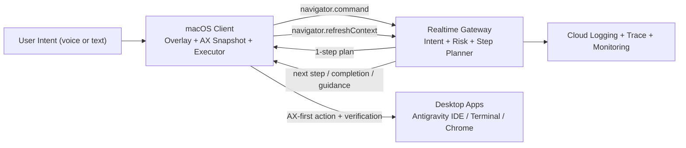

<p align="center">
  
</p>

<h1 align="center">VibeCat</h1>

<p align="center">
  <strong>A desktop UI navigator for developer workflows on macOS.</strong>
</p>

<p align="center">
  <a href="https://geminiliveagentchallenge.devpost.com/"></a>
  
  
  
  
  
</p>

> Submission note (2026-03-11): VibeCat is being repositioned for the **UI Navigator** track. Historical Live Agent planning remains in `docs/analysis/` and `docs/PRD/LIVE_AGENTS_PRD.md`, but the current submission truth is in this README, `docs/CURRENT_STATUS_20260311.md`, `docs/FINAL_ARCHITECTURE.md`, and the deployment evidence docs.

## What VibeCat Does

VibeCat keeps its on-screen character and voice-first shell, but its role is now different:

- it listens for natural user intent, not exact trigger phrases
- it watches the current desktop surface and accessibility tree
- it acts when the intent is clear
- it asks a short clarification question when the intent is ambiguous
- it avoids blind clicks, verifies each step, and falls back to guided mode when confidence is low

The submission target is:

> **works across most desktop apps with usable accessibility or visual signals, optimized for Antigravity IDE + Terminal + Chrome**

## Why This Fits UI Navigator

The [UI Navigator rules](https://geminiliveagentchallenge.devpost.com/rules) require:

- visual UI understanding
- executable actions
- Google-hosted agents

VibeCat now centers those three requirements:

- **Visual understanding**: screen capture plus frontmost app, window, focused element, selected text, and accessibility snapshot
- **Executable actions**: focus app, open URL, hotkey, text paste, selection copy, and accessibility press actions
- **Cloud-hosted reasoning**: a Cloud Run gateway classifies intent, guards risky actions, and plans one step at a time

## Hero Workflow

The primary demo workflow is:

1. Antigravity IDE shows a broken test or failing behavior.
2. The user gives a natural command such as “take me to the right docs” or “apply the relevant fix”.
3. VibeCat infers the intent, asks only if the request is ambiguous, then acts.
4. It moves through Chrome, Terminal, and Antigravity one step at a time.
5. Each step is verified before the next one is planned.

Support workflows:

- GitHub issue page -> Antigravity symbol/file navigation
- Cloud Console logs in Chrome -> Antigravity local code jump

## Safety Model

VibeCat uses **safe-immediate execution**:

- low-risk actions execute immediately when intent is clear
- ambiguous requests trigger a single clarification prompt
- risky actions require confirmation or guided mode
- unsupported or low-confidence targets never receive blind clicks

Low-risk actions:

- focus changes
- opening pages
- search entry
- short command entry
- symbol or file navigation
- tab switching

Blocked or confirmation-only actions:

- passwords, tokens, secrets
- submit/send/publish flows
- deploy or production changes
- delete or destructive shell commands
- `git push`
- long bulk code insertion

## Architecture



Current implementation layers:

- `VibeCat/`: macOS client, overlay UI, chat panel, capture, accessibility navigator, playback
- `backend/realtime-gateway/`: auth, websocket transport, navigator intent/risk/step handling, Gemini Live integration
- `backend/adk-orchestrator/`: existing ADK analysis/search backend retained for research and contextual assistance

## Quick Start

### Prerequisites

- macOS 15+
- Xcode 16+ for local client builds
- Go 1.24+
- a Google Cloud project with the required secrets for deployed backend use

### Local Build

```bash
cd VibeCat
swift build
swift test
```

```bash
cd backend/realtime-gateway
go test ./...
```

```bash
cd backend/adk-orchestrator
go test ./...
```

### Runtime Permissions

VibeCat requires:

- Screen Recording
- Accessibility
- Microphone

Without Screen Recording and Accessibility, navigator mode cannot provide reliable UI actions.

## Deployment

The deployed baseline uses:

- Cloud Run in `asia-northeast3`
- Firestore
- Secret Manager
- Cloud Logging, Trace, and Monitoring

See:

- `docs/CURRENT_STATUS_20260311.md`
- `docs/evidence/DEPLOYMENT_EVIDENCE.md`
- `docs/deployment/PROOF_OF_GCP_DEPLOYMENT.md`

## Submission Assets

The submission-facing source of truth is:

- `docs/CURRENT_STATUS_20260311.md`
- `docs/FINAL_ARCHITECTURE.md`
- `docs/analysis/DEMO_STORYBOARD.md`
- `docs/evidence/DEPLOYMENT_EVIDENCE.md`
- `docs/deployment/PROOF_OF_GCP_DEPLOYMENT.md`
- `docs/PRD/UI_NAVIGATOR_PRD.md`

Historical Live Agent planning remains in the repo for auditability, but it is no longer the submission truth.
