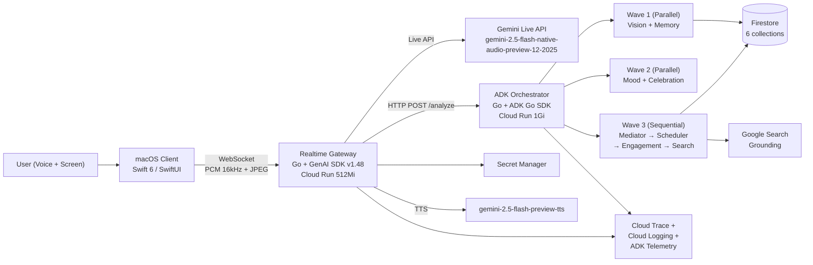
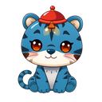
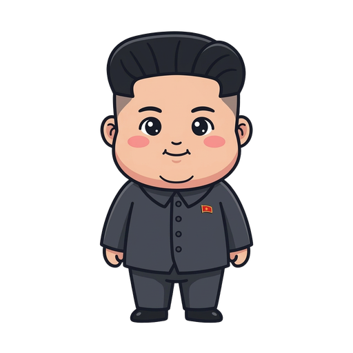
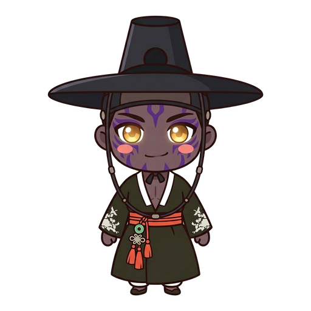

<p align="center">
  
</p>

<h1 align="center">VibeCat</h1>

<p align="center">
  <strong>Your AI coding companion that watches, listens, remembers, and helps.</strong>
</p>

<p align="center">
  <a href="https://geminiliveagentchallenge.devpost.com/"></a>
  
  
  
  
  <a href="https://github.com/Two-Weeks-Team/vibeCat/issues"></a>
  
</p>

<p align="center">
  <a href="#architecture">Architecture</a> &#8226;
  <a href="#data-flow">Data Flow</a> &#8226;
  <a href="#9-agent-graph">9-Agent Graph</a> &#8226;
  <a href="#characters">Characters</a> &#8226;
  <a href="#quick-start">Quick Start</a> &#8226;
  <a href="#deployment">Deployment</a>
</p>

---

> Current status note (2026-03-11): the current implementation, deployment, CI, and open-issue baseline live in [`docs/CURRENT_STATUS_20260311.md`](docs/CURRENT_STATUS_20260311.md), [`docs/evidence/DEPLOYMENT_EVIDENCE.md`](docs/evidence/DEPLOYMENT_EVIDENCE.md), and [`AGENTS.md`](AGENTS.md). PRD, analysis, and `.sisyphus/` documents include dated planning and audit snapshots and should not be treated as the live ops source of truth by themselves.

## What is VibeCat?

VibeCat is a **macOS desktop companion for solo developers** — filling the empty chair next to you.

When you code alone, there is no one to catch your typos, notice you are stuck, or celebrate when your tests finally pass. VibeCat sits on your screen as an animated character that **sees your work, hears your voice, remembers yesterday's context, senses your frustration, and speaks up only when it matters**.

It is not a chatbot that waits for your question. It is a colleague that watches, listens, cares, and helps.

> Built for the [Gemini Live Agent Challenge 2026](https://geminiliveagentchallenge.devpost.com/) using **GenAI SDK** + **Google ADK** + **Gemini Live API** + **VAD**.

---

## Architecture

### Three-Layer Split



| Layer | Technology | Location | Port | Role |
|-------|-----------|----------|------|------|
| **macOS Client** | Swift 6, SwiftUI, SPM | `VibeCat/` | — | UI, screen capture, audio I/O, gestures, 60fps animation |
| **Realtime Gateway** | Go 1.24 + GenAI SDK v1.48 | `backend/realtime-gateway/` | 8080 | WebSocket proxy to Gemini Live API, TTS streaming, session resumption |
| **ADK Orchestrator** | Go 1.24 + ADK Go SDK | `backend/adk-orchestrator/` | 8080 | 9-agent graph with 3-wave execution, Firestore persistence |
| **Persistence** | Firestore | GCP `asia-northeast3` | — | Sessions, metrics, memory, history, searches, users |

### Key Protocols

- **Client <-> Gateway**: WebSocket (`wss://{host}/ws/live`) + REST (`/api/v1/auth/{register,refresh}`)
- **Gateway <-> Orchestrator**: HTTP `POST /analyze`, `POST /search` (Cloud Run ID token auth)
- **Audio**: PCM 16kHz 16-bit mono (client -> server), PCM 24kHz (server -> client)
- **Video**: JPEG frames via `SendRealtimeInput(Video)` (Fast Path), Base64 JPEG via `/analyze` (Smart Path)
- **Auth**: Device UUID -> JWT (HS256, 24h), API key in GCP Secret Manager (never on client)

---

## Data Flow

### Dual-Path Screen Capture

```
1Hz ScreenCaptureKit (cursor region, multi-monitor)
       |
       v
  ImageDiffer (32x32 thumbnail, ~1ms)
       |
       |-- No change --> skip
       |
       |-- Fast Path (5s cooldown)
       |     Background thread: JPEG encode
       |       --> GatewayClient.sendVideoFrame()
       |             --> session.SendRealtimeInput(Video: JPEG blob)
       |                   --> Gemini Live API (realtime vision context)
       |
       '-- Smart Path (15s cooldown)
             Background thread: base64 encode
               --> GatewayClient.sendScreenCapture(base64)
                     --> Gateway POST /analyze --> ADK Orchestrator
                           --> 9-agent graph --> AnalysisResult
                                 --> companionSpeech / mood / celebration
```

### Voice Pipeline

```
Microphone (AVAudioEngine, PCM 16kHz)
       |
       v
  3-Layer Speech Protection
       |
       |-- Layer 1 (Client): rmsThreshold=0.01, bargeInThreshold=0.05
       |-- Layer 2 (Gateway): modelSpeaking guard, JPEG gating
       '-- Layer 3 (Live API): PrefixPaddingMs=500, Sensitivity=Low
       |
       v
  GatewayClient.sendAudio() --> Gemini Live API
       |
       |-- PCM 24kHz audio response --> AudioPlayer (~20ms buffer)
       |-- Transcription --> StatusBar
       '-- Model turn complete --> ADK analysis trigger
```

### Reconnection

Gateway reconnects to Gemini Live API with exponential backoff (1s, 2s, 4s) up to 3 attempts, using session resumption handles to preserve conversation context.

---

## 9-Agent Graph

A chatbot answers. A colleague **sees, hears, judges, adapts, remembers, cares, celebrates, and helps**.

### Graph Structure (3 Waves)

```
SEQUENTIAL: vibecat_graph
|
|-- PARALLEL: Wave 1 - Perception
|   |-- VisionAgent         gemini-3.1-flash-lite    Screen -> significance (0-10)
|   '-- MemoryAgent         gemini-2.5-flash-lite    Cross-session context retrieval
|
|-- PARALLEL: Wave 2 - Emotion
|   |-- MoodDetector        Rule-based               Frustration / stuck / idle
|   '-- CelebrationTrigger  gemini-3.1-flash-lite    Success detection (10min cooldown)
|
'-- SEQUENTIAL: Wave 3 - Decision
    |-- Mediator            gemini-3.1-flash-lite    Speech gating (cooldown, dedup)
    |-- AdaptiveScheduler   Rule-based               Dynamic timing adjustment
    |-- EngagementAgent     gemini-3.1-flash-lite    Proactive check-in (180s silence)
    '-- LOOP: SearchBuddy   gemini-2.5-flash         Google Search grounding (max 2 iter)
              + LLM Search  gemini-2.5-flash         llmagent + GoogleSearch + FunctionTool
```

### Agent Details

| Agent | Model | Role | Key Behavior |
|-------|-------|------|-------------|
| **VisionAgent** | `gemini-3.1-flash-lite-preview` | Screen analysis | Scores significance 0-10, detects errors/success, respects character persona |
| **MemoryAgent** | `gemini-2.5-flash-lite` | Long-term memory | Reads/writes Firestore `memory` collection, generates session summaries |
| **MoodDetector** | Rule-based | Emotional awareness | Error count tracking, silence detection, voice tone fusion |
| **CelebrationTrigger** | `gemini-3.1-flash-lite-preview` | Success detection | Triggers on significance >= 9, 10-minute cooldown, message deduplication |
| **Mediator** | `gemini-3.1-flash-lite-preview` | Speech gating | Default 10s cooldown, mood-aware 180s, significance thresholds (error=7+, focused=9+) |
| **AdaptiveScheduler** | Rule-based | Timing adjustment | Rate > 2/min: increase cooldown; Rate < 0.5/min: decrease cooldown |
| **EngagementAgent** | `gemini-3.1-flash-lite-preview` | Proactive outreach | 180s silence trigger, 50-minute rest reminder |
| **SearchBuddy** | `gemini-2.5-flash` | Research assistant | Google Search grounding, mood-based triggers (stuck/frustrated) |
| **LLM SearchBuddy** | `gemini-2.5-flash` | Search refinement | ADK `llmagent` + `geminitool.GoogleSearch` + `functiontool` |

### ADK SDK Usage

```go
// Workflow orchestration
sequentialagent.New()    // Wave 3, main graph
parallelagent.New()      // Wave 1, Wave 2
loopagent.New()          // Search refinement (max 2 iterations)

// Agent types
agent.New()              // Custom agents with Run functions
llmagent.New()           // LLM agent with native tool use

// Runner
runner.New(runner.Config{
    Agent:          agentGraph,
    SessionService: session.InMemoryService(),
    MemoryService:  memory.InMemoryService(),
    PluginConfig:   runner.PluginConfig{Plugins: [retryandreflect]},
})

// Tools
geminitool.GoogleSearch{}     // Native Google Search grounding
functiontool.New()            // Custom function tools
```

---

## Characters

6 animated characters with unique voices and personalities. Each has a [`preset.json`](Assets/Sprites/cat/preset.json) for voice config and a [`soul.md`](Assets/Sprites/cat/soul.md) defining their persona (injected server-side into system prompts):

| Character | Role | Voice | Tone |
|-----------|------|-------|------|
|  **cat** | Curious beginner companion | Zephyr | bright, casual |
|  **derpy** | Goofy accidental debugger | Puck | goofy, clumsy |
|  **jinwoo** | Silent senior engineer | Kore | low-calm, concise |
|  **kimjongun** | Supreme debugger (comedy) | Schedar | authoritative-warm |
|  **saja** | Zen mentor from folklore | Zubenelgenubi | calm-deep, archaic |
|  **trump** | Bombastic hype-man (comedy) | Fenrir | energetic-superlative |

Each character has 16 sprite frames (4 states x 4 frames: idle, happy, surprised, thinking).

---

## Quick Start

### Prerequisites

- macOS 15.0+, Xcode 16+
- Go 1.24+
- GCP project with Firestore, Secret Manager, Cloud Run enabled
- Gemini API key stored in Secret Manager as `vibecat-gemini-api-key`

### Build & Run (Client)

```bash
make build   # Build Swift package (SPM, swift-tools-version 6.2)
make sign    # Codesign for dev
make run     # Build + sign + run
make test    # Run Swift tests
```

### Build & Run (Backend)

```bash
# Local development
cd backend/realtime-gateway && go run .
cd backend/adk-orchestrator && go run .

# Run tests
cd backend/realtime-gateway && go test ./...
cd backend/adk-orchestrator && go test ./...
```

---

## Deployment

### One-Time GCP Setup

```bash
./infra/setup.sh    # Enable 9 APIs, create Firestore, Secret Manager, Artifact Registry, IAM
```

### Deploy to Cloud Run

```bash
./infra/deploy.sh     # Cloud Build + deploy both services to asia-northeast3
./infra/teardown.sh   # Remove Cloud Run services
```

### GCP Resources

| Resource | Service | Config |
|----------|---------|--------|
| **Cloud Run** | `realtime-gateway` | 512Mi, 0-20 instances, public, session affinity |
| **Cloud Run** | `adk-orchestrator` | 1Gi, 0-20 instances, authenticated invocation required |
| **Firestore** | 6 collections | sessions, metrics, history, searches, users, memory |
| **Secret Manager** | 2 secrets | `vibecat-gemini-api-key`, `vibecat-gateway-auth-secret` |
| **Artifact Registry** | `vibecat-images` | Docker container repo |
| **Cloud Build** | YAML only | Service-level `cloudbuild.yaml` exists, but no active GCP triggers |
| **Observability** | Cloud Logging, Monitoring, Trace | Structured logs, OpenTelemetry spans, ADK Telemetry |

### CI/CD

| Pipeline | Trigger | Jobs |
|----------|---------|------|
| **CI** (`ci.yml`) | Push / PR to master | Go build+test (both services), Swift build+test (self-hosted macOS), Docker build |
| **CD** (`cd.yml`) | Manual dispatch | Deploy to Cloud Run via Workload Identity Federation, smoke test |

---

## GenAI SDK Features Used

| Feature | Configuration |
|---------|--------------|
| **Live API** | `gemini-2.5-flash-native-audio-preview-12-2025` — bidirectional audio + video streaming |
| **VAD** | `AutomaticActivityDetection` — PrefixPadding 500ms, Silence 500ms, Sensitivity Low |
| **Barge-in** | `StartOfActivityInterrupts` + `TurnIncludesOnlyActivity` |
| **Affective Dialog** | `EnableAffectiveDialog: true` — emotional tone awareness |
| **Proactive Audio** | `ProactiveAudio: true` — model-initiated speech |
| **Session Resumption** | `SessionResumptionConfig{Handle}` — survives reconnection |
| **Context Window Compression** | Trigger 100K tokens -> Sliding window target 50K tokens |
| **TTS** | `gemini-2.5-flash-preview-tts` — streaming audio with voice selection |
| **Video Frames** | `SendRealtimeInput(Video: JPEG blob)` — realtime screen context |

---

## Project Structure

```
vibeCat/
├── VibeCat/
│   ├── Package.swift                    # SPM manifest (swift-tools-version 6.2)
│   ├── Sources/
│   │   ├── Core/                        # Pure Swift library (no UI deps)
│   │   │   ├── Models.swift             #   ChatMessage, Emotion, Mood, SpeechEvent
│   │   │   ├── AudioMessageParser.swift #   ServerMessage enum (17 types)
│   │   │   ├── ImageProcessor.swift     #   JPEG encode, resize, base64
│   │   │   ├── ImageDiffer.swift        #   32x32 screen change detection
│   │   │   ├── PCMConverter.swift       #   Int16/Float32 audio conversion
│   │   │   ├── Settings.swift           #   AppSettings (UserDefaults)
│   │   │   └── KeychainHelper.swift     #   Secure API key storage
│   │   └── VibeCat/                     # macOS app runtime
│   │       ├── AppDelegate.swift        #   Main orchestrator (597 lines)
│   │       ├── GatewayClient.swift      #   WebSocket + reconnection (686 lines)
│   │       ├── ScreenAnalyzer.swift     #   Dual-path capture (Fast + Smart)
│   │       ├── ScreenCaptureService.swift #  ScreenCaptureKit wrapper
│   │       ├── CatPanel.swift           #   Overlay window + sprite + bubble
│   │       ├── CatViewModel.swift       #   60fps mouse tracking
│   │       ├── SpriteAnimator.swift     #   Animation state machine
│   │       ├── ChatBubbleView.swift     #   Speech bubble with spring animation
│   │       ├── SpeechRecognizer.swift   #   Mic capture + VAD + barge-in
│   │       ├── AudioPlayer.swift        #   PCM playback (~20ms buffer)
│   │       ├── StatusBarController.swift #  Menu bar UI (608 lines)
│   │       └── ...                      #   CircleGesture, Onboarding, HUD, etc.
│   └── Tests/VibeCatTests/              # Swift test suite
├── backend/
│   ├── realtime-gateway/                # Go + GenAI SDK
│   │   ├── main.go                      #   Entry: Trace, Logging, JWT, GenAI, routes
│   │   ├── internal/live/               #   Gemini Live API session management
│   │   ├── internal/ws/                 #   WebSocket handler (773 lines)
│   │   ├── internal/adk/               #   ADK Orchestrator HTTP client
│   │   ├── internal/auth/              #   JWT auth (register, refresh, middleware)
│   │   ├── internal/tts/               #   TTS streaming via GenAI SDK
│   │   ├── internal/secrets/           #   GCP Secret Manager
│   │   └── cmd/videotest/              #   Live API testing tool
│   └── adk-orchestrator/               # Go + ADK Go SDK
│       ├── main.go                      #   Entry: Runner, HTTP handlers, observability
│       ├── internal/agents/graph/       #   9-agent graph (3-wave structure)
│       ├── internal/agents/vision/      #   VisionAgent (screen analysis)
│       ├── internal/agents/memory/      #   MemoryAgent (Firestore)
│       ├── internal/agents/mood/        #   MoodDetector (rule-based)
│       ├── internal/agents/celebration/ #   CelebrationTrigger
│       ├── internal/agents/mediator/    #   Mediator (speech gating)
│       ├── internal/agents/scheduler/   #   AdaptiveScheduler
│       ├── internal/agents/engagement/  #   EngagementAgent
│       ├── internal/agents/search/      #   SearchBuddy + LLM Search + Classifier
│       ├── internal/models/             #   Request/response types
│       ├── internal/prompts/            #   Prompt templates
│       └── internal/store/              #   Firestore client (6 collections)
├── infra/
│   ├── setup.sh                         # One-time GCP bootstrap (9 APIs, IAM)
│   ├── deploy.sh                        # Cloud Build + deploy both services
│   └── teardown.sh                      # Remove Cloud Run services
├── Assets/
│   ├── Sprites/{character}/             # 6 characters, 16 frames each (97 PNGs)
│   │   ├── preset.json                  #   Voice, persona config
│   │   └── soul.md                      #   Character personality prompt
│   ├── TrayIcons_Clean/                 # Menu bar icons (24 PNGs, 8 frames x 3 scales)
│   └── Music/                           # Lo-fi background tracks (2 files)
├── docs/
│   ├── PRD/                             # Product requirements (15+ docs)
│   ├── FINAL_ARCHITECTURE.md            # Complete architecture reference
│   └── reference/                       # External SDK/GCP reference (~40 files)
├── .github/workflows/
│   ├── ci.yml                           # CI: Go + Swift + Docker
│   └── cd.yml                           # CD: Cloud Run deploy + smoke test
└── voice_samples/                       # 13 voice sample files
```

---

## Tech Stack

| Category | Technology |
|----------|-----------|
| **Client** | Swift 6, SwiftUI, SPM, AppKit, AVFoundation, ScreenCaptureKit, CoreGraphics |
| **Backend** | Go 1.24+, `google.golang.org/genai` v1.48, `google.golang.org/adk` |
| **AI Models** | `gemini-2.5-flash-native-audio-preview-12-2025` (Live), `gemini-2.5-flash-preview-tts` (TTS), `gemini-3.1-flash-lite-preview` (Vision), `gemini-2.5-flash-lite` (Memory), `gemini-2.5-flash` (Search/Tooling) |
| **GenAI SDK** | Live API, VAD, Barge-in, AffectiveDialog, ProactiveAudio, SessionResumption, ContextWindowCompression, SendRealtimeInput(Video), TTS Streaming |
| **ADK** | Runner, ParallelAgent, SequentialAgent, LoopAgent, LLMAgent, InMemoryService (session + memory), RetryAndReflect Plugin, FunctionTool, GeminiTool (GoogleSearch), Telemetry |
| **Agent Graph** | 9 agents in 3 waves: Perception (Vision \|\| Memory) -> Emotion (Mood \|\| Celebration) -> Decision (Mediator -> Scheduler -> Engagement -> Search Loop) |
| **Infrastructure** | GCP Cloud Run (2 services), Firestore, Secret Manager, Artifact Registry, Cloud Build YAML |
| **Observability** | Cloud Trace (OpenTelemetry), Cloud Logging (structured JSON), Cloud Monitoring, ADK Telemetry |
| **Auth** | Device UUID -> JWT (HS256, 24h), Workload Identity Federation (CI/CD), Cloud Run ID tokens (service-to-service) |
| **CI/CD** | GitHub Actions (CI) + GitHub Actions manual deploy (CD), self-hosted macOS runner for Swift, Cloud Build YAML retained |

---

## Documentation

| Document | Description |
|----------|-------------|
| [Current Status](docs/CURRENT_STATUS_20260311.md) | Current implementation, deployment, CI, and issue baseline |
| [Deployment Evidence](docs/evidence/DEPLOYMENT_EVIDENCE.md) | Live Cloud Run, observability, and CI verification |
| [Final Architecture](docs/FINAL_ARCHITECTURE.md) | Complete system architecture with all layers, agents, data flows, and config |
| [Master PRD](docs/PRD/LIVE_AGENTS_PRD.md) | Business model, agent philosophy, architecture |
| [Document Index](docs/PRD/INDEX.md) | Complete document map |
| [Backend Architecture](docs/PRD/DETAILS/BACKEND_ARCHITECTURE.md) | 9-agent graph, Firestore schema, service contracts |
| [Client-Backend Protocol](docs/PRD/DETAILS/CLIENT_BACKEND_PROTOCOL.md) | WebSocket/REST spec, message types, error codes |
| [Deployment & Operations](docs/PRD/DETAILS/DEPLOYMENT_AND_OPERATIONS.md) | GCP Cloud Run, observability, security |
| [Implementation Execution Plan](docs/PRD/DETAILS/IMPLEMENTATION_EXECUTION_PLAN.md) | Build sequence, module dependencies |
| [Submission & Demo Plan](docs/PRD/DETAILS/SUBMISSION_AND_DEMO_PLAN.md) | Demo flow, submission artifacts |

---

## Challenge

<table>
  <tr>
    <td><strong>Event</strong></td>
    <td><a href="https://geminiliveagentchallenge.devpost.com/">Gemini Live Agent Challenge 2026</a></td>
  </tr>
  <tr>
    <td><strong>Track</strong></td>
    <td>Live Agents</td>
  </tr>
  <tr>
    <td><strong>Required Stack</strong></td>
    <td>GenAI SDK + ADK + Gemini Live API + VAD</td>
  </tr>
  <tr>
    <td><strong>Submission</strong></td>
    <td>Demo video (4 min) + Blog post (<code>#GeminiLiveAgentChallenge</code>)</td>
  </tr>
</table>

---

## License

MIT License. See [LICENSE](LICENSE) for details.
