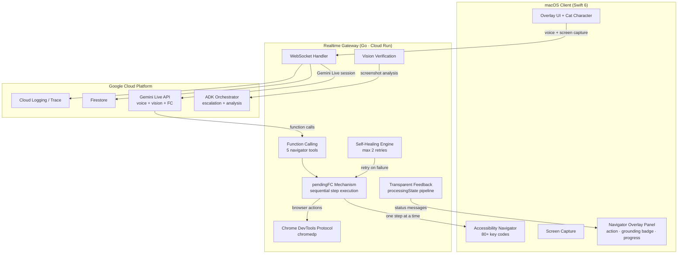

# VibeCat — Final Architecture

**Last Reviewed:** 2026-03-12
**Submission Track:** UI Navigator
**Core Identity:** Proactive Desktop Companion — OBSERVE → SUGGEST → WAIT → ACT → FEEDBACK

Current deployment and proof assets should be cross-checked with `docs/CURRENT_STATUS_20260312.md`, `docs/evidence/DEPLOYMENT_EVIDENCE.md`, and `docs/deployment/PROOF_OF_GCP_DEPLOYMENT.md`.

## System Overview

VibeCat is a **Proactive Desktop Companion** — a native macOS AI that watches your screen, suggests actions before you ask, and acts with your permission.

The runtime components:

- one user-facing `Live PM` session through Gemini Live + VAD
- one `Proactive Companion` system prompt driving OBSERVE → SUGGEST → WAIT → ACT → FEEDBACK
- five `Function Calling tools` for precise desktop control: text_entry, hotkey, focus_app, open_url, type_and_submit
- one `pendingFC mechanism` for sequential multi-step execution
- one `self-healing engine` with max 2 retries per step using alternative grounding sources
- one `vision verifier` using ADK screenshot analysis for post-action confirmation
- one `Chrome DevTools Protocol controller` (chromedp) for browser automation beyond AX tree
- one local `AX-first executor` on macOS with 80+ keyCode mappings
- one `navigator overlay panel` showing real-time action status with grounding source badges
- one `transparent feedback pipeline` emitting processingState at every pipeline stage
- one local `system action executor` for deterministic macOS interactions like volume control
- one narrow `confidence escalator` for low-confidence target resolution
- one async `background intelligence lane` for summaries, memory writes, research enrichment, replay labeling, and non-blocking screenshot context preparation

## Architecture

## Runtime Layers

### 1. macOS Client

Location: `VibeCat/`

Responsibilities:

- Gemini Live voice/text session UI
- screen capture and frontmost app/window discovery
- AX snapshot capture and normalized before-action context
- screenshot-backed visible-text extraction support for commands that must read from the current screen before typing
- local single-task action execution with 80+ keyCode mappings
- deterministic macOS system actions for basic desktop controls
- post-step verification
- guided-mode fallback when verification is unsafe
- **navigator overlay panel** displaying:
  - current action with SF Symbol icon per action type
  - grounding source badge (Accessibility / CDP / Vision / Keyboard)
  - step progress indicator (e.g. "Step 2 of 5")
  - result feedback (success / retry / failed)
- iTerm2 surface profile detection alongside Apple Terminal

Current navigator context includes:

- `appName`
- `bundleId`
- `frontmostBundleId`
- `windowTitle`
- `focusedRole`
- `focusedLabel`
- `selectedText`
- `axSnapshot`
- `inputFieldHint`
- `lastInputFieldDescriptor`
- `screenshot`
- `focusStableMs`
- `captureConfidence`
- `visibleInputCandidateCount`
- `accessibilityPermission`

Implementation anchors:

- `VibeCat/Sources/VibeCat/AccessibilityNavigator.swift` — AX executor + 80+ key codes
- `VibeCat/Sources/VibeCat/NavigatorActionWorker.swift` — step execution loop
- `VibeCat/Sources/VibeCat/NavigatorOverlayPanel.swift` — floating HUD with grounding badges
- `VibeCat/Sources/VibeCat/AppDelegate.swift` — message routing + overlay wiring
- `VibeCat/Sources/VibeCat/GatewayClient.swift` — WebSocket transport
- `VibeCat/Sources/Core/NavigatorModels.swift` — GroundingSource, NavigatorActionType, ExecutionPhase enums
- `VibeCat/Sources/Core/Localization.swift` — navigator status strings (English + Korean)

### 2. Realtime Gateway

Location: `backend/realtime-gateway/`

Responsibilities:

- websocket transport and auth
- **Proactive Companion system prompt** — OBSERVE → SUGGEST → WAIT → ACT → FEEDBACK identity
- **5 Function Calling tools** registered with Gemini:
  - `navigate_text_entry` — type text into focused field (with optional submit)
  - `navigate_hotkey` — send keyboard shortcuts (keys array + target)
  - `navigate_focus_app` — switch to a specific application
  - `navigate_open_url` — open URL in default browser
  - `navigate_type_and_submit` — type text and press Enter
- **pendingFC mechanism** for sequential multi-step execution:
  - 8 fields + 4 methods managing FC step queue
  - one step sent at a time; next step only after client confirms previous
  - prevents race conditions in complex multi-step workflows
- **self-healing navigation** with max 2 retries:
  - on step failure, attempts alternative grounding source
  - AX → CDP fallback for browser elements
  - coordinate-based targeting as last resort
- **vision verification** via ADK screenshot analysis:
  - captures post-action screenshot
  - sends to ADK for visual confirmation of success
  - feeds verification result back into step pipeline
- **Chrome DevTools Protocol (CDP)** integration:
  - chromedp v0.11.3 for Go-native CDP client
  - Click, Type, Navigate, Scroll, Screenshot, Close operations
  - lazy connect with graceful fallback when Chrome unavailable
  - targets existing Chrome instance via DevTools Protocol
- **transparent feedback pipeline**:
  - emits `processingState` messages at every navigator processing stage
  - 7 stages: analyzing_command, planning_steps, executing_step, verifying_result, retrying_step, completing, observing_screen
  - 7 localized label functions (Korean + English + Japanese)
  - client displays as real-time status bubbles — no silent processing
- **4 FC tool call handlers**: handleNavigateHotkeyToolCall, handleNavigateFocusAppToolCall, handleNavigateOpenURLToolCall, handleNavigateTypeAndSubmitToolCall
- keep `Live PM` and executable worker boundaries separate
- one active task max per session
- action state persistence and reconnect-safe lease handling
- intent classification, ambiguity handling, and risk gating
- step planning, verification, and completion tracking
- separate planning lanes for UI target actions, screen-derived text-entry actions, and macOS system actions
- confidence escalator invocation when AX confidence is too low
- async background work dispatch after task completion
- per-step metrics and replay-fixture coverage
- text-entry payload resolution split into `literal`, `intrinsic`, and `screen-derived` sources
- insertion requests may not end as `focus-only` success when payload resolution is still missing

State and evaluation features now include:

- `ActionStateStore` with in-memory hot cache + Firestore persistence
- persisted active task metadata, prompt state, current step, initial context snapshot, verified context hash, and step history
- metrics for `time_to_first_action_ms`, clarifications, replacements, guided mode, verification failure, input-field focus result, and wrong-target detection
- replay fixtures under `backend/realtime-gateway/internal/ws/testdata/navigator_replays/`

Implementation anchors:

- `backend/realtime-gateway/internal/ws/handler.go` — pendingFC mechanism, self-healing, vision verification, transparent feedback, 4 FC handlers
- `backend/realtime-gateway/internal/ws/navigator.go` — stepRetryCount, intent/task/session state
- `backend/realtime-gateway/internal/live/session.go` — Proactive Companion prompt, navigatorToolDeclarations(), SendToolResponse()
- `backend/realtime-gateway/internal/cdp/chrome.go` — ChromeController (chromedp CDP client)
- `backend/realtime-gateway/internal/ws/action_state_store.go` — state persistence
- `backend/realtime-gateway/internal/ws/metrics.go` — navigator metrics

### 3. ADK Orchestrator

Location: `backend/adk-orchestrator/`

Responsibilities in the navigator runtime:

- narrow screenshot + AX `confidence escalator`
- **vision verification** — screenshot analysis for post-action confirmation
- visible-text extraction for commands that must copy text from the current screen into a focused field
- async post-task summary generation
- async cross-session memory writes
- docs research enrichment when a task implies follow-up lookup
- replay labeling and Firestore replay persistence

Relevant endpoints:

- `POST /navigator/escalate`
- `POST /navigator/background`
- `POST /memory/session-summary`
- `POST /memory/context`
- existing `/analyze`, `/search`, `/tool`

Implementation anchors:

- `backend/adk-orchestrator/internal/navigator/processor.go`
- `backend/adk-orchestrator/internal/agents/memory/memory.go`
- `backend/adk-orchestrator/internal/store/models.go`

## Execution Contract

The execution contract is now:

1. VibeCat **proactively observes** the user's screen via Gemini Live (screenshots + AX context)
2. Gemini identifies opportunities to help and **suggests an action** via voice
3. user confirms ("yeah, go ahead") or declines
4. gateway receives Gemini's Function Calling invocation (one of 5 tools)
5. **transparent feedback**: `processingState` messages stream to client at each stage (analyzing → planning → executing → verifying)
6. **pendingFC** queues multi-step plans and sends one step at a time
7. macOS client executes the step via AX, CDP, or keyboard
8. **self-healing**: on failure, retries up to 2 times with alternative grounding source
9. **vision verification**: ADK analyzes post-action screenshot to confirm success
10. on success: next step (if any) or completion with voice feedback
11. on persistent failure: graceful fallback to guided mode or human explanation
12. completed tasks enqueue async summary/replay/memory/research work off the hot path

Alternative entry paths (retained from reactive mode):

- user explicitly commands an action → same pipeline from step 4
- ambiguous requests → one clarification question
- risky requests → explicit confirmation required
- active-task conflicts → ask whether to replace current task

## Function Calling Tools

| Tool | Parameters | Purpose |
|------|-----------|---------|
| `navigate_text_entry` | text, target, submit | Type text into a focused field |
| `navigate_hotkey` | keys[], target | Send keyboard shortcuts |
| `navigate_focus_app` | app | Switch to a specific application |
| `navigate_open_url` | url | Open URL in default browser |
| `navigate_type_and_submit` | text, submit | Type text and press Enter |

## Grounding Sources

VibeCat uses triple-source grounding to prevent blind clicking:

| Source | Badge | Technology | Use Case |
|--------|-------|-----------|----------|
| Accessibility | AX (blue) | macOS Accessibility API | Native UI element discovery and manipulation |
| CDP | CDP (orange) | Chrome DevTools Protocol (chromedp) | Precise browser element interaction |
| Vision | Vision (purple) | Gemini/ADK screenshot analysis | Visual verification and coordinate targeting |
| Keyboard | ⌨ (green) | CGEvent key injection | App-specific hotkeys (YouTube, IDE shortcuts) |

## Safety

VibeCat uses **safe-immediate execution** with mandatory confirmation for proactive suggestions:

- proactive suggestions always wait for user confirmation before acting
- low-risk, well-targeted steps may execute immediately after confirmation
- ambiguous intent never auto-executes
- low-confidence targets downgrade to clarification or guided mode
- risky actions require explicit confirmation
- wrong-target verification is counted separately from generic failure

Blocked or confirmation-only actions include:

- passwords and tokens
- destructive shell commands
- deploy/publish/send/submit flows
- `git push`
- bulk text insertion into unclear fields

## Gold-Tier Surfaces

Submission-critical reliability is concentrated on:

- **Antigravity IDE** — code editing, inline fixes, symbol navigation
- **Terminal / iTerm2** — command execution, output interpretation
- **Chrome** — URL navigation, YouTube playback, search, form filling

## Observability

The navigator path emits proof-oriented telemetry for:

- task acceptance
- clarification prompts
- replacement prompts
- time to first action
- guided-mode outcomes
- step verification failures
- input-field focus success/failure
- wrong-target detections
- **self-healing retry counts and outcomes**
- **vision verification results**
- **processingState stage transitions**

These feed Cloud Logging, Cloud Trace, and Cloud Monitoring, while completed task replays are persisted for regression comparison.
