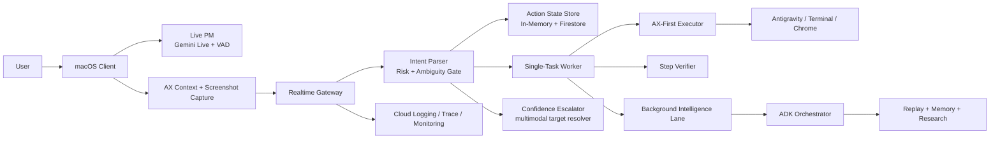

# VibeCat — Final Architecture

**Last Reviewed:** 2026-03-11
**Submission Track:** UI Navigator

Current deployment and proof assets should be cross-checked with `docs/CURRENT_STATUS_20260311.md`, `docs/evidence/DEPLOYMENT_EVIDENCE.md`, and `docs/deployment/PROOF_OF_GCP_DEPLOYMENT.md`.

## System Overview

VibeCat is a **desktop UI navigator for developer workflows on macOS**.

The runtime is intentionally narrow:

- one user-facing `Live PM` session through Gemini Live + VAD
- one `single-task action worker` for executable desktop actions
- one local `AX-first executor` on macOS
- one narrow `confidence escalator` for low-confidence target resolution
- one async `background intelligence lane` for summaries, memory writes, research enrichment, and replay labeling

## Architecture

## Runtime Layers

### 1. macOS Client

Location: `VibeCat/`

Responsibilities:

- Gemini Live voice/text session UI
- screen capture and frontmost app/window discovery
- AX snapshot capture and normalized before-action context
- local single-task action execution
- post-step verification
- guided-mode fallback when verification is unsafe

Current navigator context includes:

- `appName`
- `bundleId`
- `frontmostBundleId`
- `windowTitle`
- `focusedRole`
- `focusedLabel`
- `selectedText`
- `axSnapshot`
- `inputFieldHint`
- `lastInputFieldDescriptor`
- `screenshot`
- `focusStableMs`
- `captureConfidence`
- `visibleInputCandidateCount`
- `accessibilityPermission`

Implementation anchors:

- `VibeCat/Sources/VibeCat/AccessibilityNavigator.swift`
- `VibeCat/Sources/VibeCat/NavigatorActionWorker.swift`
- `VibeCat/Sources/VibeCat/AppDelegate.swift`
- `VibeCat/Sources/VibeCat/GatewayClient.swift`

### 2. Realtime Gateway

Location: `backend/realtime-gateway/`

Responsibilities:

- websocket transport and auth
- keep `Live PM` and executable worker boundaries separate
- one active task max per session
- action state persistence and reconnect-safe lease handling
- intent classification, ambiguity handling, and risk gating
- one-step planning, verification, and completion tracking
- confidence escalator invocation when AX confidence is too low
- async background work dispatch after task completion
- per-step metrics and replay-fixture coverage

State and evaluation features now include:

- `ActionStateStore` with in-memory hot cache + Firestore persistence
- persisted active task metadata, prompt state, current step, initial context snapshot, verified context hash, and step history
- metrics for `time_to_first_action_ms`, clarifications, replacements, guided mode, verification failure, input-field focus result, and wrong-target detection
- replay fixtures under `backend/realtime-gateway/internal/ws/testdata/navigator_replays/`

Implementation anchors:

- `backend/realtime-gateway/internal/ws/handler.go`
- `backend/realtime-gateway/internal/ws/navigator.go`
- `backend/realtime-gateway/internal/ws/action_state_store.go`
- `backend/realtime-gateway/internal/ws/metrics.go`

### 3. ADK Orchestrator

Location: `backend/adk-orchestrator/`

Responsibilities in the navigator runtime:

- narrow screenshot + AX `confidence escalator`
- async post-task summary generation
- async cross-session memory writes
- docs research enrichment when a task implies follow-up lookup
- replay labeling and Firestore replay persistence

Relevant endpoints:

- `POST /navigator/escalate`
- `POST /navigator/background`
- `POST /memory/session-summary`
- `POST /memory/context`
- existing `/analyze`, `/search`, `/tool`

Implementation anchors:

- `backend/adk-orchestrator/internal/navigator/processor.go`
- `backend/adk-orchestrator/internal/agents/memory/memory.go`
- `backend/adk-orchestrator/internal/store/models.go`

## Execution Contract

The execution contract is now:

1. user speaks or types to the `Live PM`
2. gateway classifies the utterance into `execute_now`, `open_or_navigate`, `find_or_lookup`, `analyze_only`, or `ambiguous`
3. `analyze_only` requests stay in the PM plane
4. ambiguous requests ask one clarification question
5. active-task conflicts ask whether to replace the current task
6. risky requests require explicit confirmation
7. clear low-risk requests produce exactly one planned step
8. low-confidence targets escalate through the narrow multimodal resolver instead of blind clicking
9. the macOS worker executes one step
10. the macOS verifier confirms success, guided mode, or failure
11. completed tasks enqueue async summary/replay/memory/research work off the hot path

## Safety

VibeCat uses **safe-immediate execution**:

- low-risk, well-targeted steps may execute immediately
- ambiguous intent never auto-executes
- low-confidence targets downgrade to clarification or guided mode
- risky actions require confirmation
- wrong-target verification is counted separately from generic failure

Blocked or confirmation-only actions include:

- passwords and tokens
- destructive shell commands
- deploy/publish/send/submit flows
- `git push`
- bulk text insertion into unclear fields

## Gold-Tier Surfaces

Submission-critical reliability is concentrated on:

- **Antigravity IDE**
- **Terminal**
- **Chrome**

## Observability

The navigator path emits proof-oriented telemetry for:

- task acceptance
- clarification prompts
- replacement prompts
- time to first action
- guided-mode outcomes
- step verification failures
- input-field focus success/failure
- wrong-target detections

These feed Cloud Logging, Cloud Trace, and Cloud Monitoring, while completed task replays are persisted for regression comparison.
