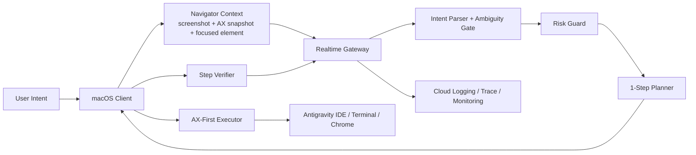

# VibeCat — Final Architecture

**Last Reviewed:** 2026-03-11
**Submission Track:** UI Navigator

Current implementation and deployment evidence should be cross-checked with `docs/CURRENT_STATUS_20260311.md`, `docs/evidence/DEPLOYMENT_EVIDENCE.md`, and `docs/deployment/PROOF_OF_GCP_DEPLOYMENT.md`.

## System Overview

VibeCat is a **desktop UI navigator for developer workflows on macOS**.

It keeps the existing animated on-screen character, voice input, and Cloud-hosted reasoning stack, but the primary behavior is now:

- infer the user's intent from natural language
- ask a single clarification question if the intent is ambiguous
- execute low-risk UI actions immediately
- verify the result after each action
- replan or fall back to guided mode when confidence is low

## Architecture

## Layer Breakdown

### 1. macOS Client

Location: `VibeCat/`

Responsibilities:

- overlay character and action-status UI
- chat input and clarification prompt handling
- screen capture and frontmost app/window discovery
- accessibility snapshot capture
- accessibility-backed action execution
- post-action verification and guided-mode fallback

Implementation evidence:

- `VibeCat/Sources/VibeCat/AccessibilityNavigator.swift`
- `VibeCat/Sources/VibeCat/GatewayClient.swift`
- `VibeCat/Sources/VibeCat/AppDelegate.swift`

Key navigator context fields:

- `appName`
- `bundleId`
- `windowTitle`
- `focusedRole`
- `focusedLabel`
- `selectedText`
- `axSnapshot`
- `priorSteps`

### 2. Realtime Gateway

Location: `backend/realtime-gateway/`

Responsibilities:

- websocket transport and auth
- navigator intent classification
- ambiguity handling
- risk gating
- one-step planning
- completion / failure / guided-mode responses
- trace and logging for every navigator step

Implementation evidence:

- `backend/realtime-gateway/internal/ws/handler.go`
- `backend/realtime-gateway/internal/ws/navigator.go`

Core public navigator events:

- client -> gateway
  - `navigator.command`
  - `navigator.refreshContext`
  - `navigator.confirmAmbiguousIntent`
  - `navigator.confirmRiskyAction`
  - `navigator.abort`
  - `navigator.requestGuidance`
- gateway -> client
  - `navigator.commandAccepted`
  - `navigator.intentClarificationNeeded`
  - `navigator.stepPlanned`
  - `navigator.stepRunning`
  - `navigator.stepVerified`
  - `navigator.riskyActionBlocked`
  - `navigator.guidedMode`
  - `navigator.completed`
  - `navigator.failed`

### 3. ADK Orchestrator

Location: `backend/adk-orchestrator/`

Responsibilities retained in the pivot:

- contextual analysis
- search grounding
- supporting research and memory paths

The orchestrator is no longer the primary submission-critical path for proactive companion behavior. It remains available to enrich navigation and research flows when helpful.

Deployment evidence:

- `docs/evidence/DEPLOYMENT_EVIDENCE.md`
- `docs/deployment/PROOF_OF_GCP_DEPLOYMENT.md`

## Execution Contract

The runtime contract is:

1. classify the user's utterance into `execute_now`, `open_or_navigate`, `find_or_lookup`, `analyze_only`, or `ambiguous`
2. if ambiguous, ask one short clarification question
3. if risky, block or require explicit confirmation
4. if clear and low-risk, plan exactly one action
5. execute through AX-first resolution
6. verify through frontmost state, AX state, or observed UI change
7. continue to the next step only after verification

## Supported Action Types

Current navigator action vocabulary:

- `focus_app`
- `open_url`
- `hotkey`
- `paste_text`
- `copy_selection`
- `press_ax`
- `wait_for`

Each step includes:

- `actionType`
- `targetApp`
- `targetDescriptor`
- `expectedOutcome`
- `confidence`
- `intentConfidence`
- `riskLevel`
- `executionPolicy`
- `fallbackPolicy`

## Gold-Tier Surfaces

Submission-critical support is concentrated on:

- **Antigravity IDE**
- **Terminal**
- **Chrome**

This is the hero workflow path used for acceptance and demo reliability.

## Safety

VibeCat uses **safe-immediate execution**:

- clear low-risk actions run immediately
- ambiguous requests never auto-execute
- risky actions never bypass confirmation
- low-confidence element resolution downgrades to guided mode instead of guessing

Blocked or confirmation-only actions include:

- passwords and tokens
- destructive shell commands
- deployment and publish actions
- send/submit flows
- `git push`
- long bulk code insertion

## Observability

Every navigator turn is expected to emit:

- intent classification outcome
- ambiguity/risk decision
- planned action
- action execution timing
- verification timing
- completion or failure outcome

These feed Cloud Logging, Cloud Trace, and Cloud Monitoring for submission proof.

Operational evidence is tracked in:

- `docs/evidence/DEPLOYMENT_EVIDENCE.md`
- `docs/deployment/PROOF_OF_GCP_DEPLOYMENT.md`
