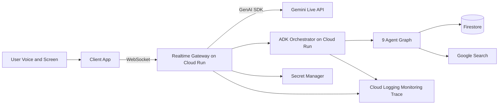

# VibeCat Live Agents PRD

> Historical note (2026-03-11): this document is preserved for auditability. It is **not** the current submission PRD. The current submission truth is `docs/PRD/UI_NAVIGATOR_PRD.md`.

Version: 2.0  
Date: 2026-03-03  
Track: Gemini Live Agent Challenge - Live Agents

## Index

- Development Purpose: `docs/PRD/LIVE_AGENTS_PRD.md`
- Business Model: `docs/PRD/LIVE_AGENTS_PRD.md`
- Core Architecture Diagram (Mermaid): `docs/PRD/LIVE_AGENTS_PRD.md`
- Implementation Requirements: `docs/PRD/DETAILS/IMPLEMENTATION_REQUIREMENTS.md`
- Implementation Status Matrix: `docs/PRD/DETAILS/IMPLEMENTATION_STATUS_MATRIX.md`
- TDD Verification Plan: `docs/PRD/DETAILS/TDD_VERIFICATION_PLAN.md`
- Implementation Execution Plan: `docs/PRD/DETAILS/IMPLEMENTATION_EXECUTION_PLAN.md`
- End-to-End Implementation Tasks: `docs/PRD/DETAILS/END_TO_END_IMPLEMENTATION_TASKS.md`
- Menu and Runtime Operations Spec: `docs/PRD/DETAILS/MENU_AND_RUNTIME_OPERATIONS_SPEC.md`
- Asset Migration Plan: `docs/PRD/DETAILS/ASSET_MIGRATION_PLAN.md`
- Deployment and Operations: `docs/PRD/DETAILS/DEPLOYMENT_AND_OPERATIONS.md`
- Submission and Demo Plan: `docs/PRD/DETAILS/SUBMISSION_AND_DEMO_PLAN.md`
- Source Map (official docs links): `docs/PRD/DETAILS/SOURCE_REFERENCE_MAP.md`

## Development Purpose

VibeCat is a desktop companion for solo developers — filling the empty chair next to you.

When you code alone, there is no one to catch your typos, notice you are stuck, or celebrate when your tests finally pass. VibeCat sits on your screen as an animated cat that sees your work, hears your voice, remembers yesterday's context, senses your frustration, and speaks up only when it matters. It is not a chatbot that waits for your question. It is a colleague that watches, listens, cares, and helps.

Implementation must use `GenAI SDK`, `ADK`, `Gemini Live API`, and `VAD (automaticActivityDetection)` together, with strict client/backend separation and backend operation on GCP.

## Business Model

- B2C SaaS: individual developer companion subscription (solo/indie tier)
- B2B SaaS: team productivity agent subscription (seat-based, shared memory)
- B2B2C: bundled partnerships with IDE/workflow platforms
- Enterprise: VPC and operations-support plans for security/audit-heavy organizations

Core value:
- fill the gap of solo development: second pair of eyes, proactive help, emotional support
- reduce debugging and exploration time with real-time screen-aware intervention
- reduce context-switching cost with multimodal voice interaction
- maintain continuity across sessions with cross-session memory

## Agent Philosophy

A chatbot answers. A colleague sees, hears, judges, adapts, remembers, cares, celebrates, and helps. VibeCat uses 9 specialized agents to replicate the full spectrum of what a real coding partner does:

| Agent | Colleague Role | What It Does |
|---|---|---|
| VAD | Natural conversation | Enables barge-in interruption, real-time turn-taking |
| VisionAgent | Second pair of eyes | Analyzes screen captures for errors, context, patterns |
| Mediator | Social awareness | Decides when to speak and when to stay quiet |
| AdaptiveScheduler | Rhythm awareness | Adjusts timing based on interaction patterns |
| EngagementAgent | Initiative | Reaches out when you have been quiet too long |
| MemoryAgent | Long-term memory | Remembers past sessions, unresolved issues, your topics |
| MoodDetector | Emotional awareness | Senses frustration, suggests breaks, offers help |
| CelebrationTrigger | Cheerleader | Detects success moments and celebrates with you |
| SearchBuddy | Research assistant | Searches for solutions when you are stuck |

## Core Architecture Diagram (Mermaid)

## Non-Negotiable Requirements

- GenAI SDK must be used
- ADK must be used
- Gemini Live API must be used
- VAD (`automaticActivityDetection`) must be used
- Client/backend separation is mandatory
- GCP deployment and operations evidence is mandatory
- 9-agent architecture must be implemented (5 core + 4 companion intelligence)
- Cross-session memory must persist across app restarts

## Document Policy

The PRD body stays concise. Detailed design, operations checklist, submission procedure, and source mapping are maintained in separate documents.
